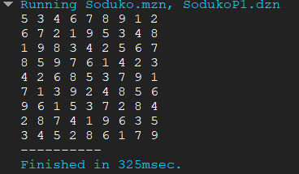
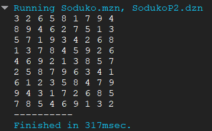
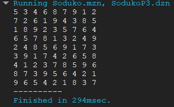
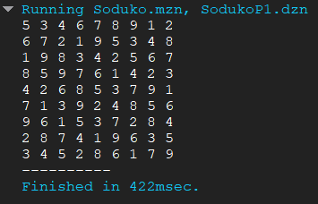
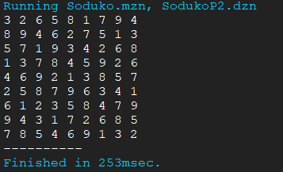
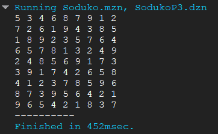
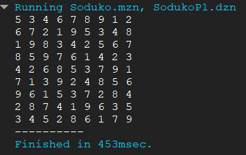

# Documentación del Modelo CSP para Sudoku

## Descripción del Modelo CSP

Este modelo utiliza Programación con Restricciones (CSP) para resolver un Sudoku clásico de 9x9. Se representa la cuadrícula como una matriz y se imponen restricciones para garantizar una solución válida.

### Lectura de datos:
- `grid`: Matriz de 9x9 que representa la cuadrícula inicial del Sudoku la cual se recibe de un arcivo .dzn, donde `0` indica una celda vacía.
 
### Variables:
- `solution_grid`: Matriz de 9x9 con valores variables de 1 a 9, que representa la solución del Sudoku.

### Restricciones:
1. **Valores iniciales:** Las celdas prellenadas en `grid` deben mantenerse en `solution_grid`.
2. **Filas distintas:** Cada fila debe contener los números del 1 al 9 sin repetir, usando `alldifferent`.
3. **Columnas distintas:** Cada columna debe contener los números del 1 al 9 sin repetir.
4. **Subcuadrículas 3x3:** Cada región de 3x3 también debe contener los números del 1 al 9 sin repetir.

## Código MiniZinc Utilizado

```minizinc
include "alldifferent.mzn";

% Lectura de datos:
array[1..9, 1..9] of 0..9: grid;

% Variables:
array[1..9, 1..9] of var 1..9: solution_grid;

% RESTRICCIONES:

% Respetar valores iniciales
constraint forall (r in 1..9, c in 1..9) (
    (grid[r, c] > 0 -> solution_grid[r, c] = grid[r, c])
);

% Restricción de filas:
constraint forall (r in 1..9) (
    alldifferent([solution_grid[r, c] | c in 1..9])
);

% Restricción de columnas:
constraint forall (c in 1..9) (
    alldifferent([solution_grid[r, c] | r in 1..9])
);

% Restricción de subcuadrículas 3x3:
constraint forall (br in 0..2, bc in 0..2) (
    alldifferent([
        solution_grid[3 * br + r, 3 * bc + c] | r in 1..3, c in 1..3
    ])
);

solve satisfy;
%%solve :: int_search([grid[r, c] | r in 1..9, c in 1..9], first_fail, indomain_min) satisfy; %Dominio más pequeño, Valor más pequeño 
%%solve :: int_search([grid[r, c] | r in 1..9, c in 1..9], input_order, indomain_random) satisfy;%Orden del grid, Valor random.

output [show(solution_grid[r, c]) ++ if c == 9 then "\n" else " " endif | r in 1..9, c in 1..9];
```

## Estrategias de Distribución y Resultados

Se probaron diferentes estrategias de distribución para asignar valores a las celdas:

1. **`Solve satsfy`**:
Indica al solver que busque cualquier solución válida que cumpla con todas las restricciones definidas en el modelo.
2. **`first_fail, indomain_min`**: Prioriza las variables con menor dominio y les asigna el menor valor posible.
3. **`input_order, indomain_random`**: Asigna valores según el orden de entrada y elige valores al azar.

### Comparación de Estrategias

| Estrategia | Ventajas | Desventajas |
|------------|----------|-------------|
| `first_fail, indomain_min` | Rápida en problemas con muchas restricciones. | Puede ser ineficiente si hay muchas soluciones. |
| `input_order, indomain_random` | Explora una variedad de soluciones. | Puede tardar más en encontrar una solución. |

### Resultados
1. **`Solve Satisfy`**:
    - 
    - 
    - 
1. **`first_fail, indomain_min`**:
    - 
    - 
    - 
1. **`input_order, indomain_random`**:
    - 
    - 
    - 


## Conclusión

El modelo CSP implementado permite resolver Sudokus de distintas dificultades utilizando restricciones de filas, columnas y subcuadrículas. Se exploraron distintas estrategias de distribución para evaluar su eficiencia y efectividad en la resolución del problema.